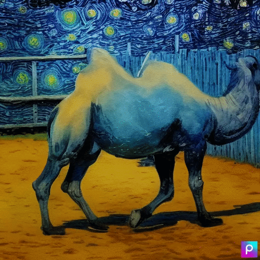
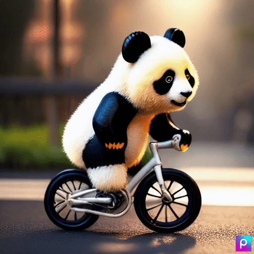

# Text-to-Video Generation

This repository contains the implementation of a text-to-video generation system that aims to generate time-consistent videos from textual descriptions. The system utilizes existing text-to-image synthesis methods and extends them to generate coherent videos.

## Project Summary

The methods used in this project are as follows:

1. **Stable Diffusion (SD) model** for text-to-image synthesis
2. **Cross-frame attention mechanism** for preserving context, appearance, and identity of the foreground object
3. **ControlNet** and **Dream-Booth diffusion models** for generating conditional and specialized videos
4. **Video Instruct-Pix2Pix** for instruction-guided video editing

The proposed method formulates the zero-shot text-to-video synthesis problem as the task of generating video frames that exhibit temporal consistency given a text description and a positive integer. By leveraging existing text-to-image synthesis methods, the system generates time-consistent videos without the need for costly training or optimization.

## Implementation Details

Text-to-image generation is achieved using deep learning-based methods that learn to generate images from textual descriptions. In this project, we propose a zero-shot text-to-video synthesis approach by modifying existing text-to-image diffusion models. These models employ a probabilistic generation procedure to generate high-quality images from textual descriptions. Our modified approach introduces motion dynamics to the generated frames and reprograms frame-level self-attention to preserve the context, appearance, and identity of the foreground object, resulting in time-consistent videos.

To incorporate motion dynamics, we perform backward and forward diffusion steps on the latent codes of the generated frames. This process allows the system to incorporate temporal consistency by adding motion dynamics to the frames. Specifically, we utilize Stable Diffusion (SD) for backward diffusion steps and Diffusion Process Model (DDPM) for forward diffusion steps. By incorporating motion dynamics into the latent codes, the generated frames appear as a coherent video with temporal consistency.

## Team Members

- [Shivansh Srivatava]
- [Shreya Garg]
- [Shubyansh Rai]
- [Rishabh]

## Output Examples

Here are some examples of videos generated using the text-to-video synthesis system:


1. [Checkout video](./temporal/movie.mp4) <br/>

2. [Checkout video](./temporal/movie2.mp4) 
Please refer to the videos above to see the outputs generated by our text-to-video synthesis system.

## Application UI


## Getting Started

To run the text-to-video generation system locally, follow these steps:

1. Clone this repository: `git clone https://github.com/your_username/text-to-video.git`
2. Install the required dependencies: `pip install -r requirements.txt`
3. Download the pre-trained models and place them in the appropriate directories.
4. Run the main script: `python app.py"`


## Contributors
```
Author : Rishabh
Contact: rbrishabh76@gmail.com

Author: Shivansh Srivastava
Contact: srivastavashiv0112@gmail.com

Author: Shreya Garg
Contact: shreyagarg031@gmail.com 

Author: Shubyansh Rai
Contact: shubhayansh@gmail.com
```

## Usage
>> Requires a A100 GPU to run Smoothly
